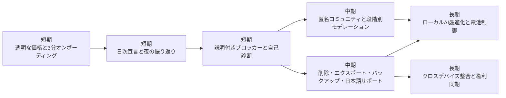

# 禁欲アプリ市場で勝てるプロダクト戦略

## エグゼクティブサマリ

結論から言うと、いま狙うべき空白地帯は、**日本語ネイティブで、初回課金の不信感が少なく、誤検知を説明でき、しかもコミュニティが安全な「ブロッカー一体型リカバリーアプリ」**です。現行市場は、BlockP・BlockerX・BlockerHero・Victoryのような「守る力」が強い blocker-first 系と、I Am Sober・Quitzilla・Rewire Companion・KinTimer・Brainbuddy のような「毎日続けさせる力」が強い tracker/community-first 系に分かれていますが、前者は誤検知・解除フロー・価格不信・安定性で、後者はコミュニティ安全性・広告・機能制限・ローカライズ・バグで取りこぼしています。citeturn29view0turn13view1turn23view1turn5view8turn28view7turn7view4turn23view2turn15view0turn6view0

優先順位は明確です。**短期で最優先**なのは、初回ペイウォールの透明化、オンボーディング摩擦の削減、誤検知時の説明UI、そして落ちないコア基盤です。**中期**では、コミュニティの安全設計、削除・エクスポートを含むプライバシー制御、日本語サポート運用を固めるべきです。**長期**では、ローカルAIの精度改善・電池最適化・クロスデバイス整合が差別化の主戦場になります。citeturn28view0turn28view1turn28view4turn29view0turn7view6turn23view1turn16search0turn28view7

MVP で絶対に外せないのは、**透明な初回体験**、**日次継続ループ**、**説明付きブロッカー**の3つです。理由は、レビュー不満の大半が「入ってすぐ信用を失う」「使い続ける途中で誤作動に萎える」「安全だと思って入ったのに誰にも説明できない」で起きているからです。citeturn28view1turn28view4turn23view1turn29view1turn28view7

## 調査対象の俯瞰

本稿は、entity["company","Google","search company"] Play と entity["company","Apple","consumer tech company"] の App Store を中心に、ユーザーが指定した10アプリを優先して見たうえで、**「どこで嫌われ、どこで支持されているか」**をプロダクト戦略に引き直したものです。アプリ別の俯瞰は次の通りです。各行の「未指定」は、同一プロダクトとして確認できる情報がストア上で明確でなかった箇所です。

| アプリ | 日本語対応状況 | ユーザーが評価した点 | ユーザーが不満を持つ点 | 戦略メモ | 根拠 |
|---|---|---|---|---|---|
| Brainbuddy | **部分対応**。Google Play では日本語説明あり。iOS の言語欄は英語のみで、日本語レビューでは翻訳の不自然さも指摘。 | 100日プログラム、学習コンテンツ、進捗可視化、コミュニティ。 | 直近アップデート後の blank screen / UI 固着、追加課金、フィルター不全、サポート不満。 | **教育プログラムの強さ**は模倣価値あり。ただし **ローカライズ品質・価格バンドル・データ保全**を改善しないと日本市場では弱い。 | citeturn11search6turn14view0turn21search14turn6view0turn21search1 |
| BlockerX | **対応**。App Store で日本語を含む25言語、Play も日本語ストア表記あり。 | 抜け道の少ないブロック、コミュニティ、アカウンタビリティ。 | 初期の評価要求、 hidden paywall 感、App Store 干渉、端末間の権利同期不満、日本語サポート負荷。 | **強い遮断力**はあるが、**信頼を削る導線**が多い。勝つなら「強いのに嫌われない blocker」に寄せるべき。 | citeturn13view1turn28view0turn28view1turn28view2turn28view3 |
| BlockP | **対応**。Play/App Store とも日本語表記・日本語言語あり。 | on-device AI、アカウンタビリティパートナー、TimeDelay、比較的 affordable という評価、サポート返信の速さ。 | 誤検知、電池消費、設定変更が遅い、 trial が forced に感じられる、iOS の AI ブロック機能差、データ共有/追跡の開示。 | **「AIで全画面を守る」価値提案**は強い。差別化するなら **説明可能性・低消費電力・OS機能差の明示**が必要。 | citeturn33search0turn14view1turn29view0turn29view1turn28view4turn28view5 |
| BlockerHero | **Android は日本語対応**。iOS は未指定。 | 無料でも10件までサイト/キーワードをブロックできる、アカウンタビリティ、アンインストール保護。 | Chrome 以外で止まる、数日ごとに権限リセットが必要になる不安定性、厳しすぎる解除文言。 | **無料価値と依存防止の厳しさ**は良いが、**止まらないこと**が最優先。UX は「厳しい」より「確実」が先。 | citeturn19search6turn19search0turn23view0turn23view1turn19search14 |
| I Am Sober | **対応**。日本語を含む24言語。 | daily pledge、理由と写真、節約可視化、日数別コミュニティ、通知の節度。 | コミュニティがトリガー化しうる、Sober Plus の paywall 反発、決済トラブル。 | **継続ループ設計の最優等生**。だが、**コミュニティ安全性**を上げてはじめて横展開できる。 | citeturn14view2turn28view7turn6view4 |
| Quitzilla | **対応**。日本語を含む27言語。 | シンプルでモダン、金額・時間節約の可視化、理由づけ。 | 無料は2 habit まで、 relapse 後も励まし通知が正しく巻き戻らない、widget 欲求、 reset 導線の改善余地。 | **軽量トラッカーの完成度**が高い。ここに **widget / relapse-aware state / 少し広い無料枠**を乗せると強い。 | citeturn14view3turn32search8turn32search7turn7view3turn7view4turn7view5 |
| Rewire Companion | **Google Play は日本語対応**。App Store の同一プロダクトは未指定。 | 統計、journal、urge helper、badges、widgets、生体ロック。 | reminder 設定でクラッシュ、 quotes が煩わしいという声、 app performance データの第三者共有。 | **「続けるための小さな報酬」**がうまい。差別化には **通知信頼性とカスタマイズ性**が重要。 | citeturn24search0turn23view2turn16search0turn11search11 |
| KinTimer | **対応**。Android/iOS とも日本語あり。 | シンプル、3つまで無料、アーカイブ、ランキング、秒単位の進捗感。 | 広告の多さ、Android ではデータ削除不可、iOS では開始日時編集や指標説明の不足。 | **軽さ・見やすさ・すぐ始められること**は大きな武器。ここは壊さず、**説明不足と広告不満**だけ潰すべき。 | citeturn15view0turn23view5turn31view0 |
| 禁欲スカイウォーカー | **対応**。国内 Android 中心、日本語前提。iOS は未指定。 | メモ、カレンダー、ランキング、比較的シンプル、直接サポート窓口。 | 広告、ランキング反映バグ、データ削除不可。 | **国内・軽量・匿名性の高い雰囲気**は差別化余地あり。課金はサブスクより買い切りが相性よい。 | citeturn15view1turn23view3 |
| Victory | **英語中心**。App Store 言語は英語のみ。 | relationship-first の accountability、check-ins、ミニコース、community。 | false positive が人間関係を傷つける、監視できない領域の限界、解約導線の悪さ。 | **伴走者を巻き込む設計**は模倣価値が高い。ただし **誤検知説明と self-serve cancellation** がないまま真似ると逆効果。 | citeturn5view8turn14view4turn7view6turn28view6turn26search1 |

## レビュー不満から見える市場の断層

最大の構造は、**「守るアプリ」と「続けさせるアプリ」が分かれすぎている**ことです。BlockP、BlockerX、BlockerHero、Victory は blocking・accountability・uninstall protection を前面に出していますが、レビュー不満は誤検知、アプリストア干渉、止まる、解約しづらいといった**信頼コスト**に集中しています。逆に I Am Sober、Quitzilla、Rewire、KinTimer、Brainbuddy は日次宣言、理由づけ、統計、journal、badges、学習コンテンツなど**継続導線**が強い一方で、コミュニティ安全性、無料機能の狭さ、広告、通知・リセットの整合性、ローカライズ品質が課題です。つまり、ユーザーは「守られたい」と同時に「毎日続けたい」のですが、既存アプリはその両立をまだ十分に実現していません。citeturn29view0turn13view1turn23view1turn5view8turn28view7turn7view4turn23view2turn15view0turn6view0

いちばん大きい離脱要因は、**最初の数分で失う信頼**です。BlockerX では「何度も評価要求が出る」「実質無料でない」という不満があり、BlockP では「長いスキップ不能アニメーション」「trial が強制に感じられる」という声があり、Brainbuddy でも「月額を払っているのに追加コース課金がある」という不満が出ています。これは、プロダクト品質以前に **“売り方のUX” で損をしている**ことを意味します。citeturn28view0turn28view1turn28view4turn6view0

次の大きな断層は、**誤検知や不具合が起きた時に、何が起きたか分からない**ことです。BlockP ではレンズやスマホレビューの YouTube 動画、手のクローズアップ、短パン姿などが誤検知として挙がり、Victory では false positive がパートナー関係に悪影響を与えたというレビューがあります。BlockerHero ではブロッカーがランダムに停止し、ユーザー自身が accessibility を入れ直す必要がありました。つまり blocker 系アプリは、「止められるか」ではなく **「止めた理由を説明できるか」「壊れた時に自己診断できるか」** が次の競争軸です。citeturn29view0turn7view6turn23view1turn19search14

日本市場視点では、**日本語対応の“質”がまだ足りない**という断層も大きいです。Brainbuddy は日本語ストア露出がある一方で日本語レビューでは翻訳品質が批判され、BlockerX の日本語レビューでは「サポートが遅く分かりづらい」「翻訳アプリと生成AIが必須」という指摘が出ています。Victory はそもそも App Store 上で英語のみです。したがって、日本語対応は単なる翻訳有無ではなく、**ネイティブ copy、FAQ、サポート言語、トラブル時のデバイス別案内まで含めた運用品質**として設計すべきです。citeturn21search14turn28view3turn14view4

最後に、**プライバシーの説明不足**が静かな不信要因になっています。BlockP は「画面内容や履歴を外部送信しない on-device AI」を謳う一方で、Play と App Store では共有・追跡・リンクされるデータ類型が一定量開示されています。Rewire Companion は生体ロックを前面に出す一方、Play では app info/performance の第三者共有が示されています。KinTimer と禁欲スカイウォーカーは Play 上で「第三者共有なし」としつつ、「データを削除できない」とされています。Victory では location・browsing history・usage data の収集が開示されています。レビューで直接炎上していなくても、**“守ってくれるはずのアプリが、何を持っていくのか分かりにくい”** という違和感は、今後の差別化ポイントになります。citeturn29view0turn14view1turn23view2turn23view5turn23view3turn14view4

## 狙うポイントの優先順位

以下は、レビュー不満をそのままプロダクト要件に翻訳した優先順位表です。短期は **信頼回復と離脱防止**、中期は **安全性と運用品質**、長期は **AI とクロスデバイスの成熟**に寄せています。

| 不満 | 対策 | 具体施策 | 実装コスト | 期待効果 | 優先度 | 根拠 |
|---|---|---|---|---|---|---|
| 初回ペイウォール | **価値提示先行の monetization** | インストール直後は paywall を出さず、最初の 1 habit・1 blocker profile・1 widget・1日目 check-in を無料で体験させる。課金は「成果が見えた瞬間」に出す。trial は任意で、スキップを明示。 | 低〜中 | 高 | 短期 | citeturn28view1turn28view4turn6view0turn28view7 |
| オンボーディング摩擦 | **3分で終わるセットアップ** | スキップ不能アニメーションを廃止。権限付与は「なぜ必要か」を1画面1目的で説明。Android は OEM 別に battery optimization / accessibility の導線を出し分ける。評価お願いは 7日後以降。 | 低〜中 | 高 | 短期 | citeturn28view0turn28view4turn19search14 |
| 誤検知 / 誤ブロック | **Explainable Blocker** | ブロック時に「画像AI」「キーワード」「URL」「SafeSearch」など理由タグを表示。 confidence が低い場合は「ぼかし＋確認」に落とし、誤検知報告は1タップで学習キューへ。許可は「今回のみ」「24時間」「パートナー承認付き」の段階制にする。 | 中〜高 | 高 | 短期 | citeturn29view0turn7view6turn19search0 |
| 安定性 / バグ | **Self-healing core** | 起動時自己診断、権限ハートビート、背景停止検知、壊れたら修復手順を自動表示。ローカル DB は crash-safe にし、連続記録はサーバーではなく端末署名付きバックアップも選べるようにする。 | 中 | 高 | 短期 | citeturn23view1turn29view1turn16search0turn6view0 |
| 解除フロー | **Humane friction** | 本当に危険な解除だけ friction を強くし、ホワイトリスト追加や App Store 利用は「理由入力 → 時限許可 → 監査ログ」で済むようにする。解約はアプリ内から自己完結できる導線を用意。 | 中 | 高 | 短期 | citeturn28view2turn23view1turn28view6 |
| 課金モデル透明性 | **Plan matrix の明示** | 無料 / Plus / Pro / Lifetime の差分表を最初から明記。月額・年額・買い切りの比較、更新日、次回請求日、解約方法、返金窓口をアプリ内で見える化する。 | 低 | 高 | 短期 | citeturn13view1turn14view1turn28view1turn28view6 |
| 日本語対応状況 | **翻訳ではなく日本語運用を持つ** | ネイティブ日本語 copy、端末別FAQ、日本語サポートテンプレ、障害時の自動返信も日本語対応。サポート文面は「設定名」を端末表示と一致させる。 | 低〜中 | 高 | 短期 | citeturn21search14turn28view3turn14view4 |
| コミュニティUX | **安全な匿名コミュニティ** | 匿名ハンドル制、同じ day count / relapse stage ごとの部屋、詳細トリガーは blur、危機語彙は自動遮断してヘルプ導線へ。公共タイムラインより、段階別 small-room と reaction 중심にする。 | 中〜高 | 高 | 中期 | citeturn28view7turn5view8 |
| プライバシー / データ削除 | **Local-first + export/delete** | journal・reasons・画像はローカル暗号化保存を基本にし、クラウドは opt-in。削除、エクスポート、バックアップ復元をアプリ内に置く。AI 処理範囲と収集データを privacy dashboard で可視化。 | 中 | 高 | 中期 | citeturn29view0turn23view2turn23view5turn23view3turn14view4 |
| カスタマーサポート | **診断付きサポート運用** | 問い合わせ時に OS・権限状態・最近のクラッシュ・ブロック理由を添付できるようにし、一次応答 SLA を 24時間以内に設定。障害時は status ページと in-app banner を出す。 | 中 | 中〜高 | 中期 | citeturn21search1turn28view3turn29view1turn16search0 |
| OS / デバイス差 | **feature parity と capability disclosure** | Android と iOS でできること / できないことを比較表で明示。同じ課金でもできる範囲が違うなら、価格か特典で補正する。端末間ライセンスは可能な限り共通化する。 | 中 | 中〜高 | 長期 | citeturn28view5turn28view3 |
| 電池消費と AI 精度 | **Battery-budgeted local AI** | 画像分類は context-aware に間引きし、SNS / browser / gallery で閾値を変える。ユーザー報告で false positive を学習し、低負荷モードを常備する。 | 高 | 高 | 長期 | citeturn29view0turn28view5turn7view6 |

短期で本当に効くのは、上のうち **初回ペイウォール、誤検知説明、安定性** の3点です。なぜなら、これらは「入れた瞬間の離脱」「使い続ける途中の離脱」「伴走者を巻き込んだ信頼崩壊」に直結しているからです。レビューの熱量もここに集中しています。citeturn28view1turn29view0turn23view1turn7view6turn28view6

## 模倣すべき成功要素

不満だけを見ると守りの戦略になりがちですが、実際には **よくできている要素を上手く接合する**ことが勝ち筋です。模倣すべき成功要素は次の通りです。

| 観点 | 模倣すべき要素 | 参考アプリ | どう取り込むか | 根拠 |
|---|---|---|---|---|
| 機能 | **daily pledge と end-of-day review** | I Am Sober | 朝に「今日は守る」、夜に「何が危なかったか」を必ず1タップで残す。これを streak より上位の体験に置く。 | citeturn5view3turn28view7 |
| 機能 | **理由・写真・節約可視化** | I Am Sober / Quitzilla | 「やめる理由」「戻りたくない理由」「浮いた時間・お金」をホームで常時見せる。 | citeturn5view3turn13view7turn32search8 |
| 機能 | **軽いゲーミフィケーション** | Rewire Companion / KinTimer / 禁欲スカイウォーカー | badge、rank、archive、widget のような軽報酬を採用し、ソシャゲ化しすぎない。 | citeturn5view5turn15view0turn15view1 |
| 機能 | **urge / SOS 介入** | Rewire Companion / BlockP / Victory | 衝動時は「ブロック」だけでなく、呼吸・短文認知再構成・パートナー連絡・緊急メモを1画面にまとめる。 | citeturn5view5turn29view0turn5view8 |
| UX設計 | **学習プログラムで“回復物語”を作る** | Brainbuddy / Victory | 7日・30日・90日でコンテンツが進む設計にして、単なる日数カウンターにしない。 | citeturn11search6turn5view8 |
| UX設計 | **同じ進行度の他者を見せる** | I Am Sober | 同じ日数帯の投稿や反応を見せることで、「自分だけではない」を体感させる。 | citeturn28view7 |
| 課金 / 信頼設計 | **無料でも核価値が触れる** | BlockP / KinTimer / Quitzilla / I Am Sober | 無料で「続けられる感じ」を掴ませてから課金に進める。無料枠は飾りではなく、リテンションの入口にする。 | citeturn29view0turn15view0turn32search1turn28view7 |
| コミュニティ運用 | **伴走者を巻き込む設計** | BlockP / BlockerHero / Victory | partner / ally / accountability をオプションで用意し、ブロック解除・応援・緊急連絡の役割を分離する。 | citeturn29view0turn23view1turn5view8 |
| プライバシー設計 | **ローカルロックの明示** | Rewire Companion | 生体認証・Passcode を visible feature として前面に出し、「守る側のアプリも見られにくい」を価値化する。 | citeturn23view2 |
| サポート運用 | **公開レビューへの迅速な回答と修正反映** | Rewire Companion / BlockP / I Am Sober | レビュー返信を単なる謝罪ではなく、バージョン番号・回避策・問い合わせ導線付きにする。 | citeturn16search0turn29view1turn6view4 |

模倣のコアは、**I Am Sober の継続導線、Brainbuddy と Victory の学習プログラム、BlockP / BlockerHero / Victory のアカウンタビリティ、Rewire / KinTimer / 禁欲系の軽量ゲーミフィケーション**を組み合わせることです。ただし、そのまま真似てはいけないのは、**I Am Sober の無防備なコミュニティ露出、BlockerX / BlockP 系の aggressive paywall、Victory 系の誤検知説明不足**です。成功要素は接合し、失敗要素は分離して捨てるべきです。citeturn28view7turn11search6turn5view8turn29view0turn23view1turn28view1turn7view6

## MVPとロードマップ

MVPで必須なのは次の3項目です。

1. **透明な初回体験**  
   スキップ可能な導入、任意 trial、明瞭な無料枠、請求と解約の見える化です。ここで疑われると、以後の機能価値は届きません。citeturn28view1turn28view4turn28view6

2. **日次継続ループ**  
   朝の pledge、夜の振り返り、理由・写真・節約の可視化、widget、軽い badge。ここがないと blocker は「怖いだけのアプリ」になり、tracker は「三日坊主のカウンター」で終わります。citeturn28view7turn13view7turn23view2turn15view0

3. **説明付きブロッカー**  
   誤検知時の理由表示、1回限り許可、partner ログ、自己診断、権限復旧支援。ここがないと relationship damage と support cost が爆発します。citeturn29view0turn7view6turn23view1turn28view2

この順番にすべき理由は、**売上より前に信頼、コミュニティより前にコア安定性、AI高度化より前に説明責任**が必要だからです。レビュー不満の重さは、まさにこの順で大きいと読めます。citeturn28view1turn23view1turn7view6turn28view7

## 実務提案

実務的には、プロダクトを **「NoFap アプリ」でも「ポルノブロッカー」でもなく、Explainable Recovery Copilot」**として設計するのが最も勝ちやすいです。理由は、現状の blocker-first は強いが怖く、tracker-first は優しいが守れないからです。この中間に、**日本語ネイティブ、local-first、partner-aware、community-safe** を置くと、既存アプリの弱点をまとめて回収できます。citeturn29view0turn13view1turn23view1turn28view7turn14view4

価格設計は、**無料の核価値を太く、課金は安心機能に寄せる**のが良いです。無料で daily pledge、記録、理由表示、1つの blocker profile、1つの widget までは使わせる。課金は partner 連携、advanced AI、cross-device、deep stats、course に寄せる。そのうえで、月額・年額だけでなく、可能なら **lifetime option** も用意し、更新日・次回請求日・解約方法を every billing screen で見せるべきです。サブスク不信は根深いので、価格の安さよりも **“騙していない感じ”** の方が効きます。citeturn13view1turn28view1turn19search0turn28view6

技術的には、Android では accessibility・VPN・device admin が絡むため、**端末別の安定化導線**がほぼ必須です。特に battery optimization と background kill は blocker 系の実効性を大きく落とします。したがって、アプリ内に OEM 別の設定ヘルプ、権限ハートビート、停止検知バナー、障害ログ送信を標準搭載すべきです。これは派手ではありませんが、レビュー不満を最も減らす投資です。citeturn19search14turn23view1turn29view1

コミュニティは後回しではなく、**作るなら最初から安全設計込みで作る**べきです。I Am Sober のような day-count 別の共感導線は非常に強い一方、無防備な public feed は逆効果になり得ます。したがって、投稿公開前の trigger classifier、詳細 relpase 記述の blur、危機語彙の遮断、匿名ID、通報の即時反映を前提にすべきです。単に「場を作る」ではなく、「壊さない場を作る」ことが差別化になります。citeturn28view7turn5view8

総合すると、勝ち筋は **BlockP の全画面 protection、I Am Sober の日次継続、Brainbuddy / Victory の学習導線、Rewire / KinTimer の軽い達成感**を統合しつつ、**BlockerX 的な paywall 不信、Victory 的な false positive、I Am Sober 的な無防備コミュニティ、BlockerHero 的な不安定さ**を避けることです。プロダクト戦略としては、**「厳しく縛る」より「信頼しながら守る」**側に振った方が、日本市場では長く勝ちやすいと考えます。citeturn29view0turn28view7turn11search6turn5view8turn23view2turn15view0turn28view1turn7view6turn23view1