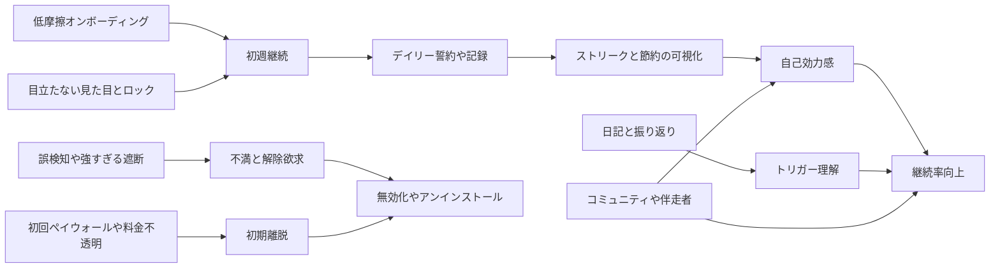

# 禁欲アプリのレビュー実査と比較分析

## エグゼクティブサマリ

本調査では、NoFap／ポルノ依存対策／習慣断ちに関係が強い10アプリを、公式ストアの公開情報とレビュー断面を中心に比較した。結論からいうと、市場は大きく **強制遮断型**（BlockP、BlockerX、BlockerHero、Victory by Covenant Eyes）、**回復伴走型**（Brainbuddy、I Am Sober、Rewire Companion）、**軽量カウンター型**（Quitzilla、KinTimer、禁欲スカイウォーカー）に分かれる。強制遮断型は「再発を物理的に止める」力が高い一方、誤検知、バッテリー、初回ペイウォール、解除のしづらさが離脱要因になりやすい。回復伴走型は継続しやすく、コミュニティ・日記・可視化が強いが、端末レベルのブロック力は弱い。軽量カウンター型は日本語ユーザーに最も導入しやすいが、遮断とコミュニティで劣る。citeturn7view1turn20view0turn26view1turn26view2turn26view3turn7view2turn26view0turn13view4turn13view0turn7view3

実利用の観点で最も完成度が高かったのは、**I Am Sober** と **Quitzilla** のような「一般依存・習慣断ち」系で、理由はオンボーディングが軽く、日数・メモ・可視化・通知・コミュニティが自然につながっているからだ。これに対し、**Brainbuddy** は教材性とコミュニティが優秀で、ポルノ依存対策としての専門性が濃いが、レビューではバグや進捗消失、追加課金への不満が目立った。ブロッカーでは **BlockP** と **BlockerHero** が強いが、前者は false positive と電池、後者は動作停止やブラウザ互換が弱点になっている。citeturn10view0turn23view3turn15view0turn24view0turn26view3turn23view0turn9view0turn7view1turn10view1turn26view1turn15view1

日本語市場だけを見ると、**禁欲スカイウォーカー** と **KinTimer** のような国内系は、「見られても禁欲アプリに見えにくい」「単純で続けやすい」点で優位だった。一方で、海外アプリが持つ AI ブロッカー、伴走者通知、深いコミュニティ、学習コンテンツを日本語ネイティブで統合した製品はまだ薄い。つまり、**“バレにくさ” と “強制力” と “伴走” を日本語で同居させた中間地帯**が、最も大きな未充足領域である。citeturn10view2turn14view0turn7view4turn20view0turn26view2turn7view2

## 調査設計と対象範囲

本稿は、entity["company","Google","technology company"] Play と entity["company","Apple","iphone maker"] の App Store における公式ストア説明とレビュー表示ページを起点に、2026年5月5日時点で比較可能性が高い10アプリへ絞り込んだ。評価軸は、日本語対応状況、UI/UX、オンボーディング、モチベーション設計、ゲーミフィケーション、コミュニティ／ソーシャル、プライバシー／データ扱い、ブロッカー機能、リマインダー／日記／統計、課金モデル、安定性／バグ、サポートである。なお、App Store と Google Play の Web 公開レビューは「全件取得」ではなく、最新・注目・地域依存の断面が中心であるため、本稿のレビュー分析は定量集計ではなく **実務判断に使える定性的比較** と位置づける。citeturn23view0turn19view0turn23view2turn23view3turn24view0turn22view1

候補探索では、ユーザー例示にあった **RAISE** や **SuperBlock** も確認した。ただし、RAISE は公式ストアの Web 表示上でレビュー本文の抽出が十分にできず、SuperBlock は Play 上で 50+ インストールとレビュー母数がかなり小さかったため、レビュー比較を主眼とするコア表からは外した。つまり、本稿は「存在確認アプリ一覧」ではなく、「レビュー根拠を伴って比較可能な代表例10本」の実査レポートである。citeturn7view4turn13view3

## 主要アプリ比較表

下表の「日本語対応状況」は、**日本語ストア表記の有無**、**日本語レビューの存在**、**App Store の言語表記が確認できる場合はその内容**を合わせて判定した。したがって「△」は、日本語ストア露出はあるが、アプリ UI の完全日本語化までは確認できていないケースを含む。

| アプリ | 類型 | ストア規模の目安 | 日本語対応状況 | レビューから見えた強み | レビューから見えた弱み | 根拠 |
|---|---|---:|---|---|---|---|
| Brainbuddy | 回復伴走・教材型 | Play 50万+ / 4.6、iOS 4.7 / 26K | △ Androidストア日本語あり、iOS言語は英語 | 100日プログラム、日次チェック、コミュニティ | バグ、進捗消失、追加課金とサポート不満 | citeturn26view3turn25search5turn23view0turn9view0 |
| BlockerX | 多機能ブロッカー型 | Play 500万+ / 4.4、iOS 4.4 / 7.6K | △ 日本語ストアあり | ブロック対象の広さ、伴走者、コミュニティ | 価格の分かりにくさ、VPN干渉、サポート不満、UXが押し売り的 | citeturn20view0turn23view1turn19view0turn27search0 |
| BlockP | AI遮断特化型 | Play 50万+ / 4.3、iOS 4.2 / 133 | △ Android日本語あり、iOSは EN + 18 more | on-device AI、パートナー通知、Focus Mode | false positive、電池、iOS初回課金導線の摩擦、リセット不満 | citeturn7view1turn23view2turn28search0turn28search1 |
| BlockerHero | 強制力重視ブロッカー | Play 100万+ / 3.5 | △ 日本語ストアあり | アンインストール保護、伴走者、無料枠が比較的使える | 動作停止、ブラウザ互換、解除フローが厳しすぎる | citeturn26view1turn15view1turn3search6 |
| I Am Sober | 汎用リカバリー型 | Play 1000万+ / 4.7、iOS 4.9 / 177K | ○ 日本語ストア・日本語レビューあり | コミュニティ、日記、マイルストーン、可視化の完成度 | バックアップや一部機能の有料化、通知や細部UXの不満 | citeturn7view2turn23view3turn17view2turn10view0 |
| Quitzilla | 軽量トラッカー型 | Play 100万+ / 4.7、iOS 4.6 / 1397 | ○ 日本語ストア・日本語レビューあり | 使いやすさ、節約額可視化、導入の軽さ | 無料版は2習慣まで、通知ロジックや請求周りの不満 | citeturn13view4turn24view0turn17view1turn15view0 |
| Rewire Companion | ポルノ特化トラッカー | Play 50万+ / 4.5 | △ 日本語ストア表記あり | バッジ、緊急モチベ、統計、コミュニティ | リマインダー系クラッシュ、細部UXの粗さ | citeturn26view0turn15view2turn25search2 |
| KinTimer | 日本語軽量カウンター | Play 1万+ / 3.8 | ◎ 日本語ネイティブ | とにかく簡単、昇格・アーカイブが分かりやすい | 広告、機能の深さや伴走要素の不足 | citeturn13view0turn14view0 |
| 禁欲スカイウォーカー | 日本語機能盛りカウンター | Play 1万+ / 4.0 | ◎ 日本語ネイティブ | 目立たないアイコン、称号・ランキング・カレンダー | 広告表示タイミング、遮断力や外部コミュニティは薄い | citeturn7view3turn10view2 |
| Victory by Covenant Eyes | 伴走者・信仰コミュニティ | Play 10万+ / 4.7、iOS 4.7 / 1.2K | △ 日本語ストア文面は確認、UI言語は未確認 | Ally、学習コース、コミュニティ、説明責任の強さ | 解約しづらさ、直感性不足、false positive、iOS側の制限 | citeturn26view2turn22view1turn22view0turn25search3 |

## 機能比較表

記号は、**◎=強い／明確**、**○=十分**、**△=限定的または未確認**、**×=ほぼなし** を意味する。「課」は課金摩擦、「安」は安定性リスクで、いずれもレビュー断面を踏まえた実務評価である。

| アプリ | 導 | 動 | 遊 | 社 | 遮 | 記 | 秘 | 課 | 安 | 根拠 |
|---|---|---|---|---|---|---|---|---|---|---|
| Brainbuddy | ○ | ◎ | ◎ | ◎ | △ | ◎ | ○ | 高 | 高 | citeturn26view3turn23view0turn9view0turn25search5 |
| BlockerX | △ | ○ | △ | ○ | ◎ | △ | △ | 高 | 中 | citeturn20view0turn19view0turn23view1 |
| BlockP | △ | △ | △ | × | ◎ | △ | △ | 高 | 中〜高 | citeturn7view1turn23view2turn16view7turn10view1 |
| BlockerHero | ○ | △ | × | × | ◎ | △ | ○ | 中 | 高 | citeturn26view1turn15view1turn14view2 |
| I Am Sober | ◎ | ◎ | ○ | ◎ | × | ◎ | ○ | 中 | 中 | citeturn7view2turn10view0turn23view3turn16view9 |
| Quitzilla | ◎ | ○ | ○ | × | × | ○ | ○ | 中 | 低〜中 | citeturn13view4turn15view0turn24view0turn17view1 |
| Rewire Companion | ○ | ◎ | ○ | ○ | × | ◎ | ○ | 中 | 中 | citeturn26view0turn15view2 |
| KinTimer | ◎ | △ | ○ | × | × | ○ | ○ | 低 | 低 | citeturn13view0turn14view0 |
| 禁欲スカイウォーカー | ◎ | ○ | ◎ | × | × | ◎ | ◎ | 低 | 低〜中 | citeturn7view3turn10view2 |
| Victory by Covenant Eyes | △ | ○ | △ | ◎ | ○ | ○ | ○ | 中〜高 | 中 | citeturn26view2turn22view1turn24view3turn22view0 |

この比較表から読み取れる重要点は明快だ。**記録・日記・コミュニティで勝つのは I Am Sober と Brainbuddy**、**遮断で勝つのは BlockP、BlockerHero、BlockerX**、**日本語で導入コストが低いのは 禁欲スカイウォーカー と KinTimer** である。つまり、ユーザーの失敗確率を下げるには「どの機能が多いか」よりも、「その人の離脱ポイントに強い設計か」で選ぶほうが正しい。citeturn23view3turn26view3turn7view1turn26view1turn20view0turn10view2turn14view0

## 主要アプリ別所見

**Brainbuddy** は、単なるストリークカウンターではなく、100日プログラム、自己診断、日次チェック、コミュニティ、瞑想・ゲーム・日記まで含めた「教材型」の回復プロダクトとして設計されている。レビューでも、コミュニティと教材、毎日向き合う導線は強く評価されており、特に「自力では続かなかったが、レッスンと進捗で戻れた」という文脈が目立つ。その一方で、iOS の App Store 表記では言語が英語のみで、日本語ネイティブ UX を期待するユーザーにはハードルが残る。citeturn26view3turn23view0turn25search5

弱みは、**価格に見合う安定性とサポートがレビュー上で十分に担保されていないこと**だ。Google Play では goal setting や victory letter の再入力、進捗消失、blank screen、サポート未返信といった不満が見える。要するに、思想とプログラムは強いが、運用品質が惜しい。学習型・本気型には最有力だが、軽く試したい層には重い。citeturn9view0turn17view0

レビュー引用: “Game changer!”, “Great App, But Won’t Work Now”, “I’m so thankful for this app”。出典ページ: App Store レビュー citeturn23view0 ／ Google Play レビュー citeturn9view0

**BlockerX** は、レビュー上でも公式説明上でも「何でもブロックする」方向に最も広く振っている。ポルノ、SNS、ゲーム、ギャンブル、キーワード、アプリ、アンインストール通知、伴走者、コミュニティまで一通り揃っており、守備範囲だけで言えば非常に広い。日本語ストア表記もあり、日本居住ユーザーのレビューも確認できる。citeturn20view0turn27search0turn16view0

ただし、レビューで最も厳しく批判されているのも **課金導線と信頼感** だ。初回から「最後のチャンス」的プロモーションが続く、premium なのに自社広告が出る、VPN が App Store を妨げる、ブロックが効かない、返金や価格体系が分かりにくい、といった不満が集中している。日本語レビューでも「フィルタリングとしては優秀だが、IT に強くないとストレス」「サポートが分かりづらい」「デバイス間同期が弱い」とされており、良くも悪くも“機能は強いが運用が重い”アプリだ。citeturn19view0turn20view0turn23view1turn18search8

レビュー引用: “YOU CAN DO IT!”, “Does what it should but interferes with App Store”, “SCAM, please don’t buy”。出典ページ: App Store レビュー citeturn23view1turn19view0 ／ Google Play レビュー citeturn20view0

**BlockP** は、本調査対象のなかで最も「AI 遮断」を正面から打ち出した製品で、ドメインの blacklist だけでなく、画面上の画像や動画サムネイルを on-device AI で判定する点が差別化要因になっている。さらに、partner notification、TimeDelay、Focus Mode、SafeSearch 強制など、**再発予防を“数秒単位で面倒にする”実装** が揃っている。Android ストアは日本語表示で、iOS 側は EN + 18 more と多言語展開も確認できる。citeturn7view1turn28search0turn28search1

一方で、レビューでは AI の過敏さがそのまま UX リスクになっている。YouTube のレンズレビューや手のクローズアップまで弾く、半裸判定が広すぎる、電池消費が大きい、iOS では free version に入る前から offer page に張りつく、といった声がある。サポート応答は比較的見えるものの、**“精度が上がるほど良い”ではなく、“誤検知をどう説明し、どう解除依頼させるか”が勝負** というアプリだ。citeturn10view1turn23view2turn16view7

レビュー引用: “Very Helpful!”, “How do I get past the limited offer page?”, “Doesn’t work”。出典ページ: App Store レビュー citeturn23view2 ／ Google Play レビュー citeturn10view1

**BlockerHero** は、BlockP や BlockerX よりもさらに「解除しにくさ」を武器にしている。アンインストール保護、伴走者承認、TimeDelay、サイト／キーワード／アプリ制限、YouTube Safe Search など、**“やろうと思っても簡単には戻れない”** ことが設計思想として明確だ。Google Play では no data shared with third parties とされている点も、同種カテゴリでは印象がよい。citeturn26view1turn14view2

しかしレビューでは、その強さが裏返って **解除 UX の激しいストレス** になっている。加えて、数日ごとに blocker が止まり、Accessibility を入れ直して再起動が必要という報告、Chrome 以外でブロックが効かない報告が目立つ。評価 3.5 は、このカテゴリではかなり低い。したがって、BlockerHero は「弱いブロッカーでは意味がない」と考えるユーザーには合うが、**安定動作が最優先の人には再検討余地がある**。citeturn15view1turn14view2

レビュー引用: “the best blocker you can download”, “stops working randomly”, “stopped blocking completely”。出典ページ: Google Play レビュー citeturn15view1turn14view2

**I Am Sober** は、ポルノ特化ではないが、回復アプリとしての完成度は今回の調査対象で最も高い部類に入る。日数カウント、理由の記録、毎日の誓約、節約時間・金額、トリガー分析、ストーリー共有、マイルストーン、withdrawal timeline、グループ、ロック、バックアップまで、継続支援の基本機能がほぼすべて揃っている。レビューでも「コミュニティ」「可視化」「日記」「ノー広告」「再発時のガイド」が repeatedly 強く評価されている。citeturn7view2turn8view4turn23view3turn10view0

弱みは、ポルノ依存対策だけに絞ると **専門特化の深さよりも汎用性が勝っている** 点と、バックアップや一部モチベ機能が有料壁の向こうにあることだ。また、通知音不具合や quote のズレなど、細部の違和感も見える。ただし、総合的には「一番人に勧めやすい」アプリの一つで、羞恥や宗教色を避けながら継続したい層にはかなり強い。citeturn23view3turn9view5turn10view0turn16view9

レビュー引用: “1,000 days sober from alcohol”, “without this app i wouldn’t be sober”, “This is my motivation to keep being SH free”。出典ページ: App Store レビュー citeturn23view3 ／ Google Play レビュー citeturn10view0

**Quitzilla** は、もっとも「軽く始めて、そこそこ続けられる」設計の代表例だ。依存対象を登録し、やめた日時、使っていた時間や金額を入れるだけで、節約額・時間・統計・報酬・quote が回り始める。Google Play 側の説明でも NoFap を明示しており、App Store / Play の両方で高評価を維持している。日本語レビューでも、秒単位で努力を実感できる点やシンプルさが強く評価されている。citeturn13view4turn24view0turn17view1

弱みは、無料版が 2 習慣までで、通知設計や relapse 後の文脈更新がやや浅いことだ。ウィジェット要望、年額契約の不満、preset habit と「時間／金額」入力の相性の悪さも見える。つまり、Quitzilla は **「軽量・視覚化・節約感」を武器にするが、伴走や遮断はほぼ持たない**。習慣断ちの入口としては優秀だが、再発予防の強制力は弱い。citeturn15view0turn24view1turn24view0

レビュー引用: “シンプルで楽しい”, “As a modern therapist, I beyond approve.”, “Costs money”。出典ページ: App Store レビュー citeturn24view0turn17view1 ／ Google Play レビュー citeturn15view0

**Rewire Companion** は、ポルノ対策に寄せた Android 専用の中量級トラッカーで、**ストリーク・統計・バッジ・コミュニティ・urge helper** のバランスがよい。Google Play では 50万+ ダウンロード、4.5、1.11万レビューと、ニッチカテゴリとしては十分な母数がある。レビューでも「best counter apps」「minimal and helpful」「badges が励みになる」という反応があり、特に relapse のたびにメモを残す構造は、単なる streak worship に寄りにくい。citeturn26view0turn15view2

弱みは、hourly reminder を含む通知まわりのクラッシュが実際に報告されていることと、quotes を消せないなど小さな irritant があることだ。とはいえ、開発者返信では修正バージョン案内があり、対応の速さは悪くない。**日本語ストア表記がある“ポルノ特化トラッカー”** としては、国内軽量アプリより一段深い選択肢だ。citeturn15view2turn25search2

レビュー引用: “best counter apps”, “pretty minimal and helpful”, “Reminder isn't working”。出典ページ: Google Play レビュー citeturn15view2

**KinTimer** は、日本語圏の軽量カウンターとしてかなり分かりやすい。日付を選ぶだけでカウントが始まり、昇格、アーカイブ、最大3カウンター無料、プレミアムで 20 カウンター、広告除去、ナイトモード、ログ解放という構成で、迷わせない。レビューでも「めちゃ使いやすい」「自制に最適」と、**導入コストの低さ自体が価値** と受け取られている。citeturn13view0turn14view0

ただし、レビューの最大不満は広告であり、コミュニティ、伴走、ブロッカー、深い統計は薄い。つまり、KinTimer は「一人で静かに続けたい」「禁欲アプリ感が強すぎるのは嫌だ」「複雑な機能はいらない」人向けであり、**多機能アプリに疲れた人の避難先** として優秀だ。citeturn14view0

レビュー引用: “めちゃ使いやすい！”, “自制に最適”, “広告多すぎ”。出典ページ: Google Play レビュー citeturn14view0

**禁欲スカイウォーカー** は、国内アプリの中では珍しく、シンプルさと機能量を両立しようとしている。日数カウント、発散時間記録、履歴、カレンダー、目標、ランキング、称号、メモという構成に加えて、レビューでは **「運動系アプリに見えるアイコン」** がプライバシー面のメリットとして明確に評価されている。データセーフティ上も「第三者との共有なし」とされている。citeturn7view3turn10view2

弱みは、広告の出るタイミングが悪く、入力中に割り込むという UX 上の損失があること、そして遮断やコミュニティは持たない点だ。それでも、**国内ユーザーの“見られたくない・でも単純カウンターだけでは物足りない”という需要にはかなりよく合っている**。派手ではないが、日本語市場では地に足のついた設計である。citeturn10view2

レビュー引用: “良質アプリ”, “入力しようとしたとき”, “シンプル且つ多機能”。出典ページ: Google Play レビュー citeturn10view2

**Victory by Covenant Eyes** は、entity["organization","Covenant Eyes","recovery software"] による関係性重視の回復支援で、**「自分一人で勝つ」のではなく「ally と一緒に進む」** 点が中心思想になっている。公式説明は Christian 文脈を明確に持ち、Activity Feed、Check-ins、Mini Courses、Community、Screen Accountability、SafeSearch、block/allow lists を訴求している。レビューでも community と group 体験の評価は高い。citeturn26view2turn22view1

ただし、弱みも明快で、解約のしづらさ、false positive、通知から目的画面へ飛べない多クリック導線、直感性不足、iOS 側で「Safari しか見ていないように感じる」という制約が不満として出ている。さらに宗教色が合わないユーザーには最初から候補外になる可能性が高い。したがって Victory は、**信頼する伴走者と宗教・共同体フレームを受け入れられるユーザーには強いが、一般市場向けの“誰にでも”アプリではない**。citeturn22view0turn22view1turn24view3

レビュー引用: “Needs Better Messaging”, “Almost perfect”, “Not 100%”。出典ページ: App Store レビュー citeturn22view1 ／ Google Play レビュー citeturn22view0

## UX要素の因果関係

複数アプリのレビューを横断すると、継続率を押し上げる要素と離脱を招く要素はかなり一貫していた。I Am Sober、Quitzilla、Brainbuddy、Rewire Companion の肯定的レビューは、まず **低摩擦の導入** から始まり、そこに **日次記録・ストリーク可視化・理由の再想起・コミュニティ** がつながることで自己効力感を作っている。一方、BlockerX、BlockP、BlockerHero、Victory では、**初回ペイウォール、過剰な遮断、誤検知、解除フローの硬さ、通知遷移の悪さ** が不満の引き金になっていた。citeturn23view3turn15view0turn23view0turn15view2turn20view0turn10view1turn15view1turn24view3

この図の実務的含意は、「最も効く機能を足す」ことではなく、**初週継続を壊す摩擦を減らしながら、日次の小さな成功を見える化する** ことだ。遮断は強ければ強いほどよいわけではなく、解除の難しさと誤検知説明の不足が、そのまま悪レビューになる。逆に、Quitzilla や I Am Sober のように、日数・時間・お金・メモ・朝晩の約束が自然につながっていると、専門特化でなくても高い支持が得られる。citeturn10view0turn23view3turn15view0turn20view0turn23view2turn15view1

## 実務的な改善点と差別化案

既存アプリへの改善提案として、まず **ブロッカー系は「何をなぜ止めたか」を説明する UX を強化すべき** だ。BlockP と Victory では false positive が対人関係や信頼にダメージを与え、BlockerHero と BlockerX では解除・例外追加・サポート到達が重すぎる。したがって、誤検知時に「検出根拠カテゴリ」「一時保留」「伴走者への例外申請」「学習済みホワイトリスト」を見せる設計が必要である。単に硬くするより、**“強いが納得できる”** ことのほうが継続に効く。citeturn10view1turn24view3turn15view1turn20view0

次に、**トラッカー系は relapse 後の UX をもっと上手く作る余地がある**。Quitzilla の通知ロジック、Brainbuddy の進捗消失、I Am Sober のバックアップ有料化に対する不満は、どれも「継続を支えるはずのアプリが、つまずいた瞬間に弱い」ことを示している。改善策としては、最長記録と現行記録の併記、再スタート時の自己否定を避けるメッセージ設計、無料の最低限バックアップ、 relapse 後の振り返りテンプレート自動提案が有効だ。citeturn24view1turn9view0turn10view0

日本語市場向けの差別化案は、かなり明確である。**国内アプリは「バレにくさ」と「軽さ」に強く、海外アプリは「遮断」と「伴走」に強い。ならば勝ち筋は、その二つを日本語ネイティブで統合すること** だ。具体的には、目立たないアイコンとアプリ名、ローカル保存の日記、顔認証ロック、端末内 AI による画像判定、解除時だけ伴走者承認、LINE など日本で強い連絡手段を前提にしたサポート、そして「恥」や「説教」ではなく「再発前提の回復」コピー。この組み合わせなら、禁欲スカイウォーカーや RAISE が示した国内 UX の感覚と、BlockP や Victory が示した海外の強制力を接続できる。citeturn10view2turn7view4turn28search0turn26view2

最後に、プロダクト戦略としては **価格の透明化** が必須だ。BlockerX、BlockP、Quitzilla、Victory には、価格や解約、無料版制限の設計が不信感につながったレビューがある。禁欲・依存対策アプリは、ユーザーがストレス・罪悪感・焦りの高い状態で使うことが多い。そこで料金が曖昧だと、機能への不満より先に「騙された」という感情が立つ。おすすめは、無料で試せる最小体験を広く保ち、プレミアムで **遮断強度・伴走者機能・データ同期** を上げる二層設計だ。今の市場は、機能不足で負けるというより、**信頼設計の不足で負けている**。citeturn19view0turn23view2turn24view0turn22view0