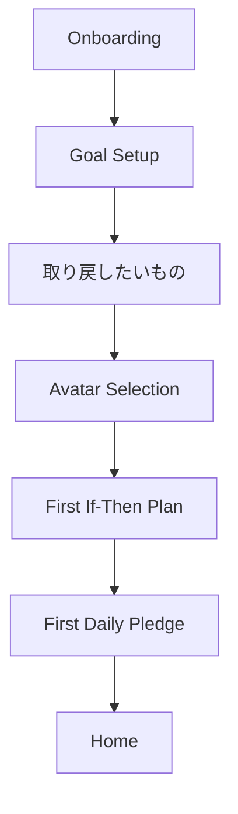

# Avatar Selection Flow

## Purpose

アバターは、ユーザーが自分の進行を少し親しみやすく感じるための軽い視覚要素である。自己評価やランキングではなく、Homeで `今日も整える` きっかけを作る。

## First-Run Flow

Onboarding内で、Goal SetupとFirst Daily Pledgeの間に任意の `Avatar Selection` を置く。3分以内でHomeへ到達する約束を優先し、アバター選択はスキップ可能にする。

## Screen Requirements

表示項目:

- 見出し: `一緒に進むアイコンを選びましょう`
- 説明: `小さな相棒をあとで選べます。今はこのまま始められます。`
- アバター一覧: 3〜5体の静止PNG
- プレビュー: Homeでの小サイズ表示
- 主CTA: `このアイコンで始める`
- 副CTA: `あとで選ぶ`, `このまま始める`

選択肢:

- neutral avatar only
- 性的、医療、宗教、過度に幼い表現を避ける
- 初期は名前なし、または中立名のみ
- 優劣、レア度、ランク、性格診断のような選択肢にしない
- 例: `静かに見守る`, `短く背中を押す`, `淡々と記録する`, `やさしく整える`

## MVP Avatar Set

ユーザー提供の4枚の人物ピクセルアートをMVPアバター候補として扱う。表示名はキャラクターの優劣や性格診断に見えない、中立的なラベルにする。

| avatarId | file | selection label | UX note |
|---|---|---|---|
| `avatar_jacket` | `assets/avatars/avatar_jacket.png` | ジャケット | カジュアルで始めやすい印象。初心者向けに見えるが、優劣は付けない。 |
| `avatar_centerpart` | `assets/avatars/avatar_centerpart.png` | センターパート | 落ち着いた普段着の印象。人前で見られても説明しやすい。 |
| `avatar_suit` | `assets/avatars/avatar_suit.png` | スーツ | 仕事、集中、整える印象に接続しやすい。成果保証の文言にはしない。 |
| `avatar_kinniku` | `assets/avatars/avatar_kinniku.png` | アクティブ | 体を動かす、切り替える印象に使える。筋力や健康効果を断定しない。 |

デフォルト:

- `あとで選ぶ` の場合は `avatar_jacket` を暫定デフォルトにする。
- 将来、抽象アイコンや中立シルエットを追加した場合は、デフォルトをそちらへ変更してもよい。

表示仕様:

- 選択グリッドでは全身が見える正方形サムネイルとして表示する。
- Homeでは小さく表示し、SOSボタンや今日の宣言を押し下げない。
- Level-up modalでは選択中アバターのみを表示する。
- ラベルは通知、ロック画面、外部共有画像には出さない。

## Later Change Flow

導線:

- `Settings > ローカルプロフィール > アバター`
- `Home > アバターをタップ > アバターを変更`

変更時の仕様:

- 変更はいつでも可能。
- 変更しても称号、記録、累計成功時間は変わらない。
- アバター変更に課金や条件解放を結びつけない。

## Display Locations

MVP:

- Homeの今日ステータス付近
- Level-up modal
- Achievement/Title detail
- Settings profile

MVPでは表示しない:

- 通知
- ロック画面
- 外部共有画像
- エクスポートファイルのファイル名

Phase 2以降:

- Calendar/Insightsの小さな空状態
- Reduced Motion対応の表情差分
- 将来コミュニティで表示する場合は別途公開範囲設定が必要

## Privacy Notes

- アバターはローカルプロフィールの一部として保存する。
- MVPではリアル写真アバターを扱わない。
- 実名、性別、年齢、性的嗜好を推測させるアバター名を使わない。
- 通知にはアバター名や称号名を出さない。
- アプリ切替画面でHomeやProfileが見える場合、設定に応じてぼかし/secure flag対象にする。
- エクスポートには選択中アバターIDを含める場合があるが、画像ファイル本体は含めない。
- 全削除時は選択中アバターIDと称号状態を削除する。
- アバターやプロフィールはウィジェット、通知、ロック画面に出さない。

## Acceptance Criteria

- 初回設定時にアバターを選べる。
- `あとで選ぶ` を選んでもHomeへ進める。
- スキップした場合は中立的なデフォルトアバターが設定される。
- 選んだアバターがHomeに表示される。
- Settingsから後で変更できる。
- アバター変更で記録や称号が失われない。
- 通知やロック画面にアバター名が出ない。
- Homeのアバター表示がSOSや主Daily CTAを第一表示範囲から押し出さない。
