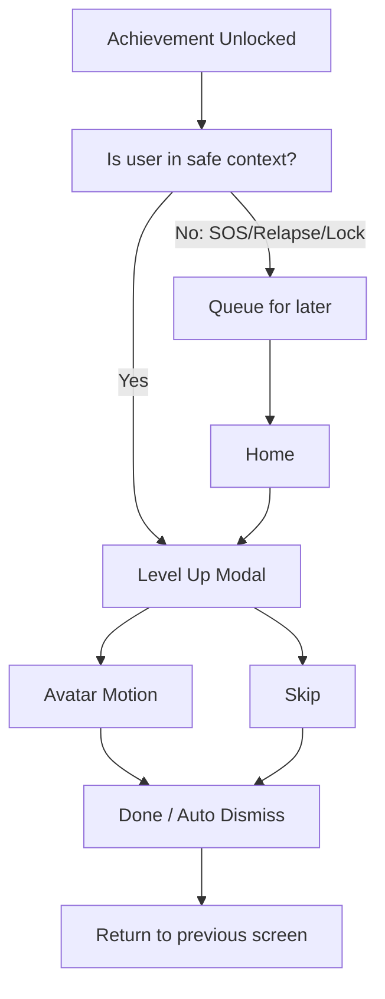

# Level Up Motion Spec

## Purpose

レベルアップ演出は、節目を短く祝うためのUI演出である。主要UIでは `レベルアップ` よりも `記録バッジ`, `できたこと`, `記録が増えました` の表現を優先する。ユーザーの集中、SOS、チェックインを妨げない。祝福は軽く、必ずスキップできる。

## Trigger Conditions

MVP:

- 初回称号解放
- 7日達成
- 14日達成
- 30日達成
- SOS称号解放
- Restart称号解放

優先トリガー:

- Daily Pledge saved
- Daily Review saved
- SOS completed
- Reason Card viewed during urge
- Restart Flow completed

日数だけを主要トリガーにしない。

表示しないタイミング:

- SOS起動直後
- Relapse Log入力中
- Privacy Lock解除前
- アプリ起動直後の復帰でユーザーが急いでいる状態

未表示キュー:

- 表示できないタイミングで解放された称号は、Homeに戻った後に軽く表示する。

## Screen Flow

## Modal Layout

表示項目:

- 選択中アバター
- 見出し: `7日分の記録が残りました`
- サブコピー: `新しい記録バッジを手に入れました`
- 補足: `ここまでの記録は残っています`
- 主CTA: `閉じる`
- 副CTA: `できたことを見る`
- スキップ: 右上 `スキップ`

時間:

- 1.2〜2.0秒の演出
- 3秒以内に自動で閉じる、またはCTA表示
- ユーザー操作で即時スキップ可能
- Reduced Motionでは700ms以内のフェードのみにする

## Motion Ideas

MVPは静止PNGに対するUIアニメーションで表現する。

1. Jump
   - アバターを 8〜12dp 上へ移動して戻す。
   - 反復は1回まで。

2. Scale
   - 1.0 -> 1.06 -> 1.0。
   - 過度に跳ねない。

3. Glow
   - アバター背面に薄い円形の発光。
   - 0.8秒程度でフェードアウト。

4. Confetti
   - 紙吹雪は少量。
   - 画面全体を覆わない。
   - 色は落ち着いたトーン。
   - MVPでは標準OFFでもよい。

5. Reduced Motion
   - Jump/Scaleを無効化。
   - 発光フェードのみ。
   - 紙吹雪なし。

## Skip And Reduced Motion

- Modal右上に `スキップ` を置く。
- `設定 > 表示と演出 > 演出を控えめにする` を用意する。
- OSのアニメーション削減設定に従う。
- スキップしても称号獲得状態は保存する。
- スキップした称号は称号一覧で確認できる。

## Avoid Long Or Intrusive Motion

- SOS導線を塞がない。
- Daily quick check-in完了後に長く足止めしない。
- 音声、振動、フルスクリーン動画はMVPでは使わない。
- 連続で複数称号が解放された場合は1つのまとめ表示にする。
- relapse直後はジャンプ/紙吹雪ではなく、次の24時間カードの静かな表示にする。

まとめ表示例:

`2つの称号を手に入れました`

## Error / Edge Cases

- アバター画像が読み込めない: デフォルトアイコンで表示。
- アニメーション失敗: 静止モーダルのみ表示。
- アプリがバックグラウンドへ移動: 次回Homeで未表示キューを確認。
- Privacy Lock有効時: ロック解除後に表示。

## Acceptance Criteria

- 演出はスキップできる。
- 3秒以上ユーザーを拘束しない。
- Reduced Motion時は控えめ表示になる。
- relapse後に称号剥奪/レベルダウン演出が出ない。
- SOSやRelapse入力中に割り込まない。
- 動画/Rive/LottieなしでMVP実装できる。
