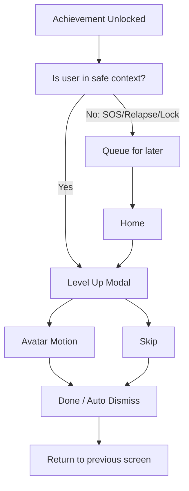

# Level Up Motion Spec

## Purpose

レベルアップ演出は、節目を短く祝うためのUI演出である。主要UIでは `レベルアップ` よりも `記録バッジ`, `できたこと`, `記録が増えました` の表現を優先する。ただし7日、14日、30日などの節目では、通常画面より少し派手な祝祭モードを許可する。ユーザーの集中、SOS、チェックインを妨げず、必ずスキップできる。

## Trigger Conditions

MVP:

- 初回称号解放
- 7日達成
- 14日達成
- 30日達成
- SOS称号解放
- Restart称号解放

優先トリガー:

- Daily Pledge saved
- Daily Review saved
- SOS completed
- Reason Card viewed during urge
- Restart Flow completed

日数だけを主要トリガーにしない。

表示しないタイミング:

- SOS起動直後
- Relapse Log入力中
- Privacy Lock解除前
- アプリ起動直後の復帰でユーザーが急いでいる状態

未表示キュー:

- 表示できないタイミングで解放された称号は、Homeに戻った後に軽く表示する。

## Screen Flow

## Modal Layout

表示項目:

- 選択中アバター
- 見出し: `7日間達成!!` または `7日分の記録が残りました`
- 称号/記録バッジプレート: `7日分の記録`, `強者` など。ただし最終文言は人に見られても恥ずかしくないか確認する。
- サブコピー: `新しい記録バッジを手に入れました`
- 補足: `ここまでの記録は残っています`
- 主CTA: `閉じる`
- 副CTA: `記録確認` または `できたことを見る`
- スキップ: 右上 `スキップ`

時間:

- 2.0〜2.8秒の演出
- 3.2秒以内にCTA操作可能状態へ戻す
- ユーザー操作で即時スキップ可能
- Reduced Motionでは700ms以内のフェードのみにする

## Motion Ideas

MVP+では、静止PNGに対するUIアニメーションに加え、アバター別の連続フレームを再生できるようにする。フレームが存在しない場合は静止PNG + UIアニメーションへフォールバックする。

1. Avatar Frame Animation
   - `assets/avatars/level_up/{avatarId}/frame_*.png` を順番に表示する。
   - 基本は 5〜6フレーム、全体 900〜1300ms。
   - `jacket` はガッツポーズの連続ポーズを参考にする。
   - `centerpart` はガッツポーズの連続ポーズを参考にする。
   - `suit` はガッツポーズの連続ポーズを参考にする。
   - `kinniku` は拳を上げる連続ポーズを参考にする。
   - 他アバターも、ジャンプ、胸を張る、軽く手を上げるなど、前向きだが煽りすぎない動きにする。

2. Jump / Pop
   - アバターを 16〜28dp 上へ移動して戻す。
   - Scaleは 1.0 -> 1.12 -> 1.0 まで許可する。
   - 着地時に 0.96〜1.0 の軽い squash を入れてよい。

3. Glow / Burst
   - アバター背面に円形の発光。
   - 参考画像のような濃色モーダル上では、青緑または白の控えめな縁光を許可する。
   - 0.8〜1.2秒程度でピーク後フェードアウト。

4. Confetti
   - 紙吹雪は中量まで許可する。
   - 画面全体を完全には覆わない。
   - モーダル上半分から左右に散る程度にする。
   - 色は落ち着いたトーンを基本に、節目だけ少し明るくしてよい。

5. Title Plate
   - 称号/記録バッジはプレート状に表示してよい。
   - 金属風、光沢、装飾枠は許可するが、競合アプリや既存ゲームの称号プレートに似せない。
   - `強者` のようなゲーム寄り文言は、MVPでは仮表示またはA/B候補として扱い、最終採用前に日本語UX/プライバシー観点で確認する。

6. Reduced Motion
   - Jump/Scaleを無効化。
   - フレーム再生を停止し、代表フレームのフェードのみ。
   - 発光フェードのみ。
   - 紙吹雪なし。

## Skip And Reduced Motion

- Modal右上に `スキップ` を置く。
- `設定 > 表示と演出 > 演出を控えめにする` を用意する。
- OSのアニメーション削減設定に従う。
- スキップしても称号獲得状態は保存する。
- スキップした称号は称号一覧で確認できる。

## Avoid Long Or Intrusive Motion

- SOS導線を塞がない。
- Daily quick check-in完了後に長く足止めしない。
- 音声、振動、フルスクリーン動画はMVPでは使わない。
- 連続で複数称号が解放された場合は1つのまとめ表示にする。
- relapse直後はジャンプ/紙吹雪ではなく、次の24時間カードの静かな表示にする。
- `7日間達成!!` のような強い祝福は節目モーダル内だけに留め、Homeや通知では使わない。

まとめ表示例:

`2つの称号を手に入れました`

## Error / Edge Cases

- アバター画像が読み込めない: デフォルトアイコンで表示。
- アニメーション失敗: 静止モーダルのみ表示。
- アバターフレームが足りない: 既存フレームを補間せず、静止PNG + UIアニメーションへフォールバック。
- アプリがバックグラウンドへ移動: 次回Homeで未表示キューを確認。
- Privacy Lock有効時: ロック解除後に表示。

## Acceptance Criteria

- 演出はスキップできる。
- 3.2秒以上ユーザーを拘束しない。
- Reduced Motion時は控えめ表示になる。
- アバターが連続フレームまたはUIモーションで動く。
- relapse後に称号剥奪/レベルダウン演出が出ない。
- SOSやRelapse入力中に割り込まない。
- 動画/Rive/Lottieなしで、PNGフレームまたは静止PNG + Compose animationでMVP実装できる。
