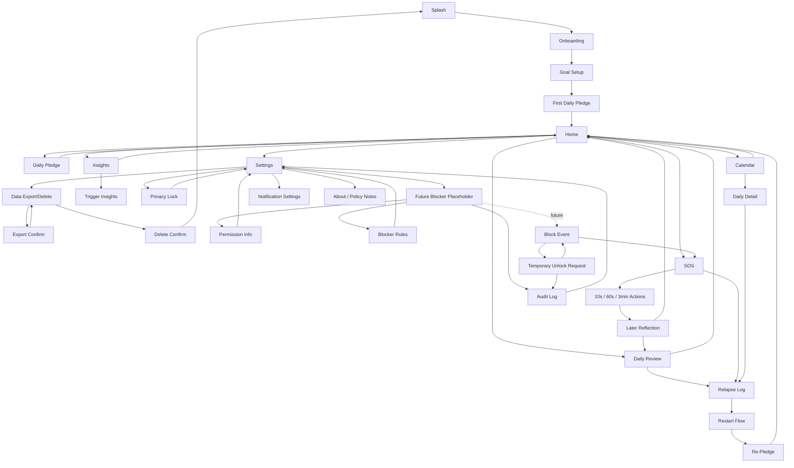

# Screen Flow

## Flow Rules

- Onboarding中に課金、広告、評価依頼を出さない。
- Goal Setupは後から変更可能にする。
- SOSはHomeとBottom Navigationから1タップ。
- Relapse Logは任意入力で進める。
- Data Deleteは確認後に初期状態へ戻る。
- Future BlockerはMVPでは権限要求ではなく説明と配置のみ。

