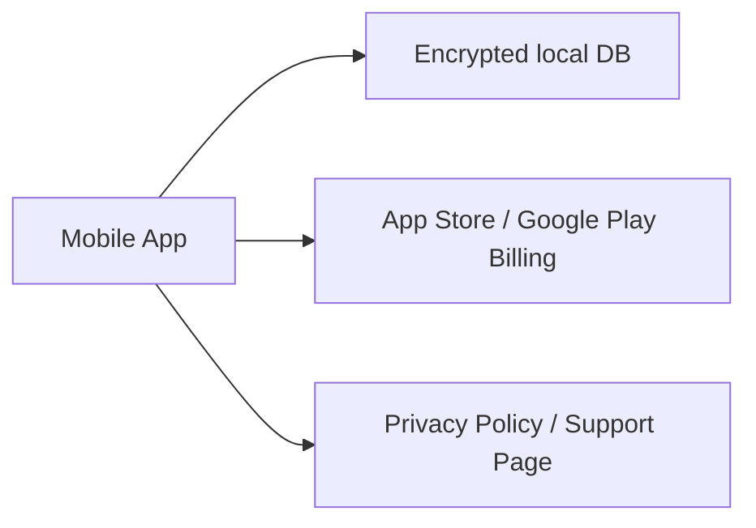
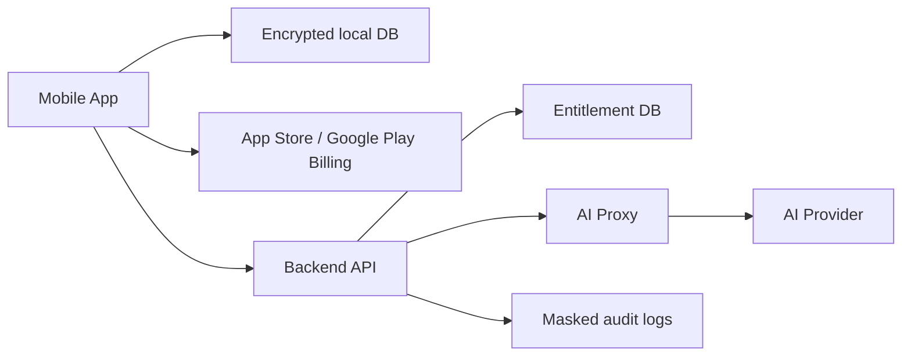

# App Release Data and Infrastructure Specification

## 目的

EmotionLeaveをApp Store / Google Playへ公開する場合の、データの持ち方、外部送信、インフラ構成、プライバシー、個人情報保護、セキュリティの基本仕様を定義する。

EmotionLeaveは、衝動、relapse、トリガー、メモ、日次振り返りなど、非常にセンシティブな自己管理データを扱う。そのため、原則はlocal-first、外部送信は明示同意と必要最小限、広告・分析・AIへの二次利用は禁止または厳格に制限する。

## 基本結論

MVPリリースでは、アカウントなし、クラウド同期なし、記録データは端末内保存を推奨する。サーバーは、必須でない限り持たない。

Plus / AI分析 / サブスクリプション検証を導入する段階では、以下の最小インフラだけを追加する。

- 課金レシート検証・Entitlement管理用の最小API。
- AI分析のための同意済みデータ送信API。
- AIプロバイダーAPIキーをアプリに埋め込まないためのサーバーサイドAI proxy。
- プライバシーポリシー、問い合わせ、削除依頼受付の公開ページ。

## データ分類

| 分類 | 例 | 扱い |
| --- | --- | --- |
| Core local data | 継続日数、Daily Pledge、Daily Review、カレンダー、称号、アバター設定 | 原則端末内保存 |
| Sensitive reflection data | メモ、relapse理由、トリガー、気分、睡眠・疲労・ストレス自己申告 | 端末内保存。AI利用時のみ明示同意後に最小送信 |
| SOS data | SOS起動日時、選択アクション、SOSメモ | 端末内保存。AI分析対象に含める場合は同意必須 |
| Future blocker data | ブロックルール、ブロックイベント、解除理由 | 原則端末内保存。URLやアプリ名の外部送信は禁止を初期方針にする |
| Subscription data | Store user idに紐づく購入状態、プラン、期限 | サーバー保存可。ただし記録データとは分離 |
| Technical diagnostics | クラッシュ、エラー種別、OS/Appバージョン | メモ本文、relapse詳細、トリガー名を含めない |
| Ads data | 広告ID、広告表示状態 | センシティブデータと結合しない。パーソナライズ広告に使わない |

## 端末内保存方針

- 記録データは暗号化されたローカルDBに保存する。
- 暗号鍵はiOS Keychain / Android Keystoreなど、OSの安全な鍵管理に置く。
- アプリ内ログ、クラッシュログ、分析イベントにメモ本文、relapse詳細、トリガー名、ブロッカー詳細を含めない。
- エクスポートはユーザー操作時のみJSON/CSVで生成する。
- エクスポートファイルはアプリ保護外になるため、生成前に注意文を表示する。
- 全データ削除は端末内DB、ローカルキャッシュ、AI分析キャッシュ、エクスポート準備ファイルを対象にする。
- Android Auto Backup / iCloud backupへ機微データが入るかを実装時に明示判断する。初期方針は、機微DBを自動バックアップ対象外にする。

## アカウント方針

MVPではアカウントを作らない。アカウントがない構成は、収集する個人情報を減らし、ストア審査・漏えいリスク・削除対応を単純化できる。

将来アカウントを導入する場合は、以下を必須にする。

- アカウント作成は任意。
- アカウントなしでも基本SOS、Daily Pledge、Daily Review、relapse記録、カレンダー、データ削除を利用できる。
- アカウント削除をアプリ内から開始できる。
- アカウントIDとセンシティブ記録は分離して保存する。
- メールアドレス、OAuth ID、課金ID、広告ID、分析IDをrelapse詳細やメモ本文と直接結合しない。

## クラウド同期方針

MVPではクラウド同期を提供しない。同期を導入する場合は、ユーザーの明示的な opt-in とする。

同期を導入する場合の条件:

- 同期ON/OFFをSettingsから変更できる。
- 同期対象データを説明する。
- 同期しないデータを説明する。
- 端末内データ削除とクラウドデータ削除の違いを説明する。
- 転送時はTLS、保存時は暗号化、鍵管理はKMS等で行う。
- 可能であればエンドツーエンド暗号化またはユーザー鍵管理を検討する。

## AI分析インフラ

AI分析を導入する場合、アプリからAIプロバイダーへ直接APIキー付きで通信しない。サーバーサイドAI proxyを置き、以下を実施する。

- AI分析の同意状態を確認する。
- Plus entitlementを確認する。
- 送信データを最小化する。
- メモ本文、relapse記録、SOSメモはユーザーが許可した場合のみ送る。
- プロンプト、レスポンス、要約、特徴量、キャッシュの保持期間を定義する。
- AI分析用データ削除の要求で、サーバー側キャッシュも削除する。
- AIプロバイダーの保持、学習利用、ログ処理、サブプロセッサを確認し、プライバシーポリシーへ反映する。

AIに送る前の推奨加工:

- ユーザーIDを直接送らず、分析用の一時IDまたは疑似IDを使う。
- メモ本文を送る場合も、不要な固有名詞、連絡先、URLを除去する余地を検討する。
- 週次・月次分析では、生データ全量ではなく期間要約を優先する。

## 課金・Entitlementインフラ

サブスクリプションはApp Store / Google Playの課金機構を使う。クレジットカード番号などの決済情報はアプリ・自社サーバーで保持しない。

サーバーで保持してよい最小データ:

- appUserIdまたは匿名インストールID。
- store platform。
- productId。
- subscription status。
- expiresAt。
- lastVerifiedAt。

保持しないデータ:

- カード番号。
- 請求先住所。
- relapse記録。
- メモ本文。
- AI分析の生プロンプト。ただし一時処理に必要な場合は保持期間を短く定義する。

## 広告・分析SDK方針

広告SDKと分析SDKは、導入前にData Safety / App Privacyへ反映する。センシティブデータを広告・分析に渡さない。

- relapse履歴、衝動、性的行動、トリガー、メモ、ブロッカー履歴を広告セグメントに使わない。
- パーソナライズ広告は初期方針として使わない。
- 広告IDとセンシティブ記録を結合しない。
- 分析イベントは画面到達、クラッシュ種別、課金画面表示程度に絞る。
- `sos_started` のようなイベント名もセンシティブに見えるため、外部分析では中立名またはローカル集計を検討する。
- 18歳未満を対象外にするか、年齢配慮を入れるかをリリース前に確定する。

## 推奨インフラ構成

### MVP

MVPでは、ユーザー記録は端末外へ送らない。課金を入れない場合はStore Billingも不要。

### Plus / AI導入後

Backend APIは課金状態、AI同意、AI送信の最小化、削除要求を扱う。Entitlement DBとAI分析データは分離する。

## セキュリティ要件

- 通信はTLS 1.2以上、可能であればTLS 1.3を使う。
- APIキー、AIプロバイダーキー、Webhook secretをアプリに埋め込まない。
- サーバー秘密情報はSecret Manager等で管理する。
- DBは保存時暗号化を有効にする。
- 管理者アクセスは最小権限、MFA必須、操作ログを残す。
- 本番データを開発・検証環境へコピーしない。
- 監査ログはpayloadをマスクし、メモ本文やrelapse詳細を含めない。
- レート制限、Bot対策、署名検証、Webhook検証を実装する。
- 脆弱性のあるSDKを定期的に更新する。
- 障害時もセンシティブデータをエラーレポートに含めない。

## データ保持・削除

| データ | 保持方針 | 削除 |
| --- | --- | --- |
| 端末内記録 | ユーザー管理 | アプリ内全削除 |
| エクスポートファイル | ユーザー管理 | アプリ外保存後はユーザー責任を説明 |
| Entitlement | 課金状態確認に必要な期間 | アカウント削除または法令・ストア要件に従う |
| AI分析キャッシュ | 最短期間。MVPでは保存しない方針を推奨 | AI分析用データ削除で削除 |
| クラッシュログ | 短期保持 | ログ基盤の保持期間で自動削除 |
| 監査ログ | セキュリティ目的に必要な期間 | payloadはマスクし、保持期間後に削除 |

## App Store / Google Play提出時の説明項目

### App Store Privacy Nutrition Label

実装時点のSDKとデータフローに基づいて、以下を確認する。

- 収集するデータの種類。
- ユーザーにリンクされるデータ。
- トラッキングに使うデータ。
- 第三者SDKが収集するデータ。
- AIプロバイダー、広告SDK、分析SDKへの共有有無。

### Google Play Data Safety

実装時点で以下を確認する。

- 収集するデータ。
- 共有するデータ。
- データの暗号化。
- ユーザーがデータ削除をリクエストできるか。
- 任意収集か必須収集か。
- 健康・ウェルビーイングに近いデータとして扱うべき項目。

### プライバシーポリシー

プライバシーポリシーには、少なくとも以下を明記する。

- 収集するデータ。
- 収集しないデータ。
- 利用目的。
- 外部送信先。
- 広告、分析、AI、課金SDKの利用。
- データ保持期間。
- データ削除方法。
- 問い合わせ先。
- 第三者提供または委託先。
- 日本の個人情報保護法、ストアポリシー、配信地域に応じた追加事項。

## 日本の個人情報保護観点

日本向けに公開する場合、個人情報保護法と個人情報保護委員会のガイドラインを確認する。EmotionLeaveでは、実名を扱わない場合でも、インストールID、課金ID、広告ID、問い合わせメール、記録データの組み合わせにより個人に紐づく可能性がある。

仕様上の方針:

- 利用目的を明確にする。
- 目的外利用をしない。
- 第三者提供・委託・国外移転がある場合は説明する。
- 本人からの開示、訂正、利用停止、削除の問い合わせ導線を用意する。
- 漏えい等が発生した場合の報告・通知フローを別途運用設計する。

## 未決事項

- iOS / Androidの両方で出すか、最初はAndroidのみか。
- アカウントをMVPで作らない方針を維持するか。
- クラウド同期をいつ導入するか。
- AI分析で外部AIを使うか、オンデバイスAIを待つか。
- 広告を非パーソナライズに限定するか、完全に広告なしでPlusのみから始めるか。
- Android Auto Backup / iCloud backupから機微DBを除外する実装方針。
- プライバシーポリシーの正式な法務レビュー担当。

## Policy References

- Apple App Review Guidelines: https://developer.apple.com/app-store/review/guidelines/
- Apple App Privacy Details: https://developer.apple.com/app-store/app-privacy-details/
- Apple account deletion guidance: https://developer.apple.com/support/offering-account-deletion-in-your-app/
- Google Play User Data policy: https://support.google.com/googleplay/android-developer/answer/10144311
- Google Play Data Safety form guidance: https://support.google.com/googleplay/android-developer/answer/10787469
- Google Play Health Content and Services: https://support.google.com/googleplay/android-developer/answer/12261419
- Google Play AccessibilityService API policy: https://support.google.com/googleplay/android-developer/answer/10964491
- Personal Information Protection Commission, Japan: https://www.ppc.go.jp/
- PPC laws and guidelines: https://www.ppc.go.jp/personalinfo/legal/
